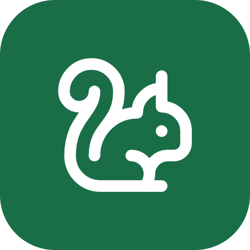
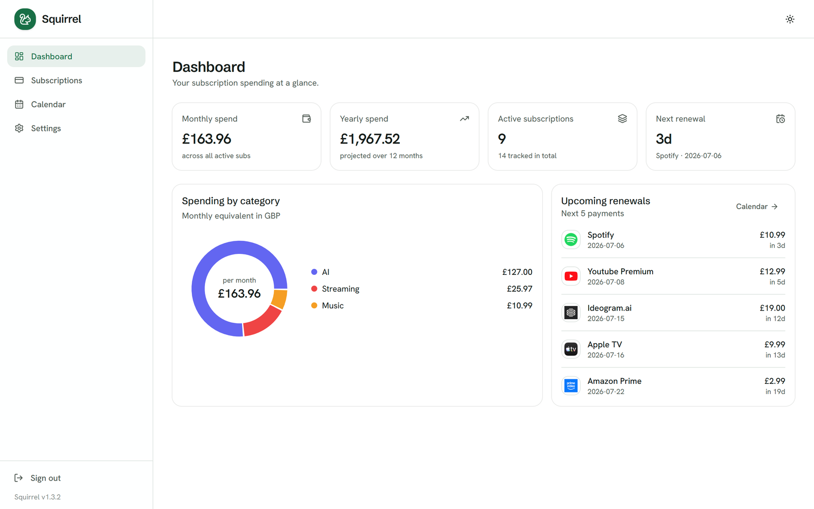
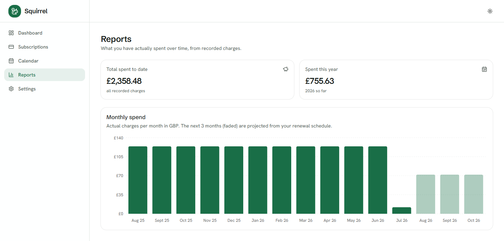
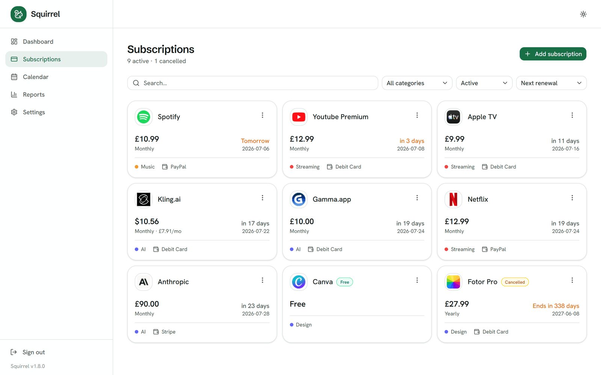
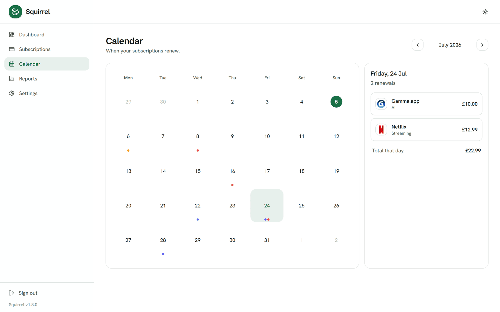
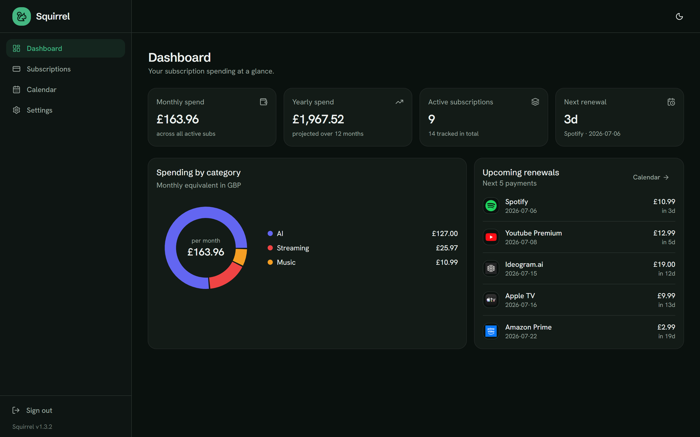
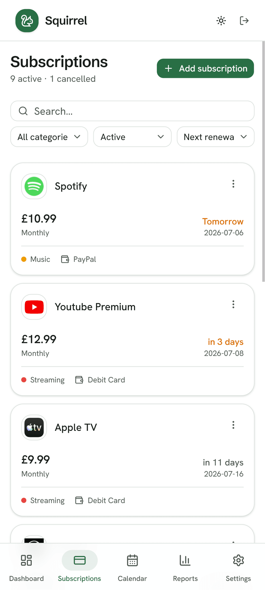

<div align="center">



# Squirrel

**A personal, self-hosted subscription tracker.**

See what you spend each month, catch renewals before they hit, and know what
you're still paying for, all from one small container on your own NAS.

[](#install-on-a-nas--homelab-recommended)
[](#tech)
[](#tech)
[](#access-over-https-for-pwa-install)
[](LICENSE)

<br/>



</div>

Built to run as a single Docker container on a home NAS. Single user, no cloud,
no account, nothing leaves home. Renewal dates are computed on read from an
immutable start date, so nothing to sync and nothing drifts.

## Screenshots

<table>
  <tr>
    <td colspan="2"><br/><sub><b>Reports</b> — actual spend over time, with totals, from a ledger of every charge</sub></td>
  </tr>
  <tr>
    <td width="50%"><br/><sub><b>Subscriptions</b> — every service with its logo, price and next renewal</sub></td>
    <td width="50%"><br/><sub><b>Calendar</b> — see the month at a glance</sub></td>
  </tr>
  <tr>
    <td width="50%"><br/><sub><b>Dark mode</b> — out of the box</sub></td>
    <td width="50%" align="center"><br/><sub><b>Installable PWA</b> — on your phone, as an app</sub></td>
  </tr>
</table>

## Features

- **Track subscriptions** with price, currency, billing cycle (e.g. every 3
  months), category, payment method, start date, free-trial end and notes,
  each with an auto-fetched brand logo (or pick one from a few candidates).
- **Dashboard** — monthly & yearly spend, spend by category, upcoming renewals.
- **Calendar** — a month view of exactly when each subscription renews.
- **Reports** — a ledger records every real charge (with the FX rate locked at
  the time), then charts your actual monthly spend over time plus total-spent-to-date
  and this-year totals. This is real cashflow, distinct from the dashboard's
  normalized monthly average.
- **Search, filter & sort** — filter by category or status (active / cancelled /
  free / inactive); sort by next renewal, name, or price (high–low).
- **Multi-currency** — track subs in any currency; totals convert to your base
  currency using free daily ECB rates (Frankfurter, no API key).
- **Renewal reminders** — a daily push before a subscription renews — via **ntfy**, **Telegram**, or **email** (enable any combination).
- **Cancellations** — mark a subscription cancelled and it stays usable until
  the end of the paid period, then automatically drops to inactive on that date.
  It leaves your spend totals right away (it's already paid and won't renew), so
  your monthly figure stays accurate. No more forgetting what you've cancelled
  but can still use.
- **Free-tier tracking** — flag a service you're on the free plan for. It's kept
  for awareness but left out of spend totals, renewals and reminders.
- **Export & backup** — download your payment history and subscriptions as CSV
  for spreadsheets or tax, or take a full JSON backup and restore it onto any
  Squirrel instance (a one-click, atomic replace). Your data, portable.
- **Install as an app (PWA)** — add Squirrel to your phone's home screen for a
  native-style experience with a bottom nav bar and slide-up forms. (Installing
  standalone needs HTTPS — see [Access over HTTPS](#access-over-https-for-pwa-install).)
- **Light & dark** themes, responsive, keyboard-friendly.
- **Optional password** login, or open access on a trusted LAN.

## Install on a NAS / homelab (recommended)

Squirrel ships as a prebuilt multi-arch image on the GitHub Container Registry,
so **any** Docker host runs the same thing — TrueNAS SCALE, Unraid, Synology, a
Raspberry Pi, or plain `docker compose`. There's nothing to build and no source
to clone; you just paste a Compose stack.

**Paste this stack** (TrueNAS "Custom App → Install via YAML", Dockge, Portainer
"Stacks", or a `compose.yaml` file), edit the two secrets, and deploy:

```yaml
services:
  squirrel:
    image: ghcr.io/code-by-gunnar/squirrel:latest
    container_name: squirrel
    restart: unless-stopped
    ports:
      - "8480:3000"
    environment:
      APP_PASSWORD: "change-me"
      SESSION_SECRET: "replace-with-a-long-random-string"
      BASE_CURRENCY: "GBP"
      TZ: "Europe/London"
    volumes:
      - squirrel-data:/app/data
volumes:
  squirrel-data:
```

Then open `http://YOUR-NAS-IP:8480`.

Before deploying, edit two values:

- `APP_PASSWORD` — your login password. Leave it as `""` for open access on a
  trusted LAN.
- `SESSION_SECRET` — any long random string. Generate one with
  `openssl rand -base64 32` (keep the surrounding quotes when you paste it in).

The `8480:3000` line is `host:container` — change `8480` if that port is taken.
The database lives in the `squirrel-data` named volume; to keep it on a specific
dataset instead, replace that volume line with a bind mount, e.g.
`- /mnt/tank/apps/squirrel:/app/data`.

> **Tip:** paste the YAML exactly as shown. Don't add inline `#` comments with
> punctuation like em dashes or `<angle brackets>` — some stack editors reject
> non-ASCII characters with a "yaml: construct errors" message.

**Updating:** pull the new image and recreate — `docker compose pull && docker
compose up -d` (Dockge/Portainer have an "update" button that does this). Your
data in the volume is preserved.

## Access over HTTPS (for PWA install)

Squirrel works fine over plain `http://YOUR-NAS-IP:8480` in a browser. But to
**install it as an app** on your phone — a home-screen icon that opens
full-screen with no address bar — it must be served over **HTTPS**. Browsers
only treat `https://` and `localhost` as a "secure context" and won't register
the service worker otherwise; over plain HTTP a phone just adds a bookmark that
opens in a browser tab.

Put any reverse proxy with a valid TLS certificate in front (Nginx Proxy
Manager, Caddy, Traefik, a Cloudflare Tunnel, or Tailscale). Two headers are
**required**, or login will bounce you back to the sign-in page as soon as you
navigate:

```nginx
proxy_set_header Host              $host;   # match the browser's origin
proxy_set_header X-Forwarded-Proto $scheme; # tell Squirrel the request is HTTPS
```

Use a real hostname with a trusted certificate, not `https://<ip>` — a cert
warning still counts as an insecure context and blocks the install. Then, on the
phone, use the browser's **Install app** option (not "Add to Home screen").

## Run from source (development)

```bash
git clone https://github.com/code-by-gunnar/squirrel.app && cd squirrel.app
cp .env.example .env
# edit .env: set APP_PASSWORD and a random SESSION_SECRET
docker compose up -d --build
```

This uses the repo's `docker-compose.yml` (which builds the image locally and
bind-mounts `./data`). To update: `git pull && docker compose up -d --build`.

## Configuration

All via environment variables (see `.env.example`):

| Variable | Default | Purpose |
|----------|---------|---------|
| `APP_PASSWORD` | _(empty)_ | Login password. Empty = no auth (open on LAN). |
| `SESSION_SECRET` | _(change me)_ | Signs the session cookie. Use a long random string. |
| `BASE_CURRENCY` | `GBP` | Base currency for totals (also changeable in Settings). |
| `TZ` | `Europe/London` | Timezone for the daily FX + reminder jobs. |

Base currency, reminder lead time, categories, payment methods and ntfy config
are all editable in **Settings** once running.

## Notifications

Each channel (ntfy, Telegram, Email) can be independently enabled in Settings. A channel only sends when both enabled **and** fully configured; an unconfigured channel is simply inert and won't block saving. Reminders go out `N` days before a renewal (configurable) and again on the day, to every enabled channel.

### ntfy

1. Install the [ntfy app](https://ntfy.sh/app) on your phone.
2. Choose a topic (e.g. `squirrel-alerts-<random>`) and subscribe to it on your phone.
3. In Squirrel → **Settings**, enable **ntfy** and enter the same topic.
4. Click **Test ntfy** to send a test notification.

**Self-hosted ntfy (optional):** run your own ntfy server alongside Squirrel so the default channel needs no third party. Add this service to the Compose stack you deployed:

```yaml
  ntfy:
    image: binwiederhier/ntfy:latest
    container_name: squirrel-ntfy
    command: serve
    environment:
      NTFY_BASE_URL: "http://YOUR-NAS-IP:8481"
    ports:
      - "8481:80"
    volumes:
      - ntfy-cache:/var/cache/ntfy
      - ntfy-data:/var/lib/ntfy
    restart: unless-stopped

volumes:
  ntfy-cache:
  ntfy-data:
```

If your stack already has a top-level `volumes:` block, merge these two entries into it rather than adding a second `volumes:` key. Then in Squirrel → **Settings**, set *ntfy server* to `http://ntfy` — Squirrel publishes to the bundled server over the internal Docker network — and subscribe your phone's ntfy app to `http://YOUR-NAS-IP:8481/<topic>` (the external address).

> **On your phone, point the ntfy app at your NAS — not `http://ntfy`.** That hostname only resolves *inside* the Docker network, so your phone can't reach it. In the ntfy app, set the server to `http://YOUR-NAS-IP:8481`: either open **Settings → Default server** and set it there, or when adding the subscription choose **Use another server** and enter it. If you used ntfy.sh before, make sure the app now points at your local server (not `ntfy.sh`) — otherwise the subscription listens to the wrong server and no notifications arrive.

### Telegram

1. Message [@BotFather](https://t.me/botfather) on Telegram and run `/newbot`. Follow the prompts and copy the bot token.
2. In Squirrel → **Settings**, enable **Telegram** and paste the token.
3. Send your new bot a message on Telegram (anything will do).
4. Click **Detect** in Settings to fill in your chat ID automatically.
5. Click **Test Telegram** to send a test message.

> **Detect finds nothing?** Telegram sometimes doesn't surface your first message right away — send the bot a second message (or wait a few seconds), then click **Detect** again. To check directly, open `https://api.telegram.org/bot<your-token>/getUpdates` in a browser: your messages appear as JSON, and you can copy the `chat.id` value straight into the **Chat id** field by hand if Detect still comes up empty.

### Email

1. In Squirrel → **Settings**, enable **Email**.
2. Fill in your SMTP server details (e.g. Gmail: `smtp.gmail.com:587` with an [app password](https://support.google.com/accounts/answer/185833)).
3. Enter your sender email address (From) and the recipient address (To).
4. Click **Test email** to send a test message.

Channel tokens and passwords are stored in Squirrel's database and included in JSON backups — keep backups private.

## Local development

```bash
npm install
npm run dev        # http://localhost:3000
npm test           # billing/currency unit tests
npm run build      # production build
```

The database is created at `./data/squirrel.db` on first run; migrations and
default categories/payment methods are applied automatically.

## Tech

Next.js 16 (App Router, React 19) · TypeScript · Tailwind + shadcn/ui (Base UI)
· SQLite via Drizzle ORM · node-cron for the daily jobs. Renewal dates are
computed on read from an immutable start date, so they never drift.

See [docs/plans/2026-07-02-squirrel-design.md](docs/plans/2026-07-02-squirrel-design.md)
for the full design.

## Acknowledgements

Squirrel was inspired by [Wallos](https://github.com/ellite/Wallos), a superb
open-source subscription tracker by [@ellite](https://github.com/ellite). Wallos
sparked the idea and shaped several of Squirrel's early features. Squirrel is an
independent reimplementation with its own codebase (Next.js/TypeScript rather
than PHP) and its own direction, but full credit to Wallos for lighting the way.
If you want a mature, battle-tested option today, go give it a star.

## License

Released under the [MIT License](LICENSE). Do what you like with it.
